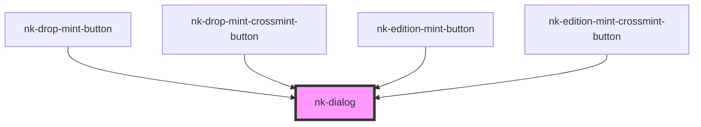

# nk-dialog

<!-- Auto Generated Below -->

## Properties

| Property      | Attribute      | Description | Type      | Default     |
| ------------- | -------------- | ----------- | --------- | ----------- |
| `buttonText`  | `button-text`  |             | `string`  | `'Confirm'` |
| `dialogTitle` | `dialog-title` |             | `string`  | `''`        |
| `open`        | `open`         |             | `boolean` | `false`     |

## Dependencies

### Used by

 - [nk-drop-mint-button](../nk-drop-mint-button)
 - [nk-drop-mint-crossmint-button](../nk-drop-mint-crossmint-button)
 - [nk-edition-mint-button](../nk-edition-mint-button)
 - [nk-edition-mint-crossmint-button](../nk-edition-mint-crossmint-button)

### Graph

----------------------------------------------

*Built with [StencilJS](https://stenciljs.com/)*
