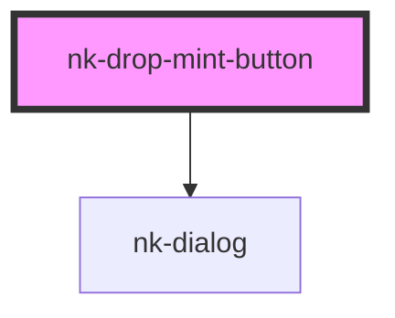

# nk-drop-mint-button

<!-- Auto Generated Below -->

## Properties

| Property         | Attribute         | Description                       | Type     | Default                        |
| ---------------- | ----------------- | --------------------------------- | -------- | ------------------------------ |
| `successMessage` | `success-message` | Body message on the success modal | `string` | `'Successfully minted an NFT'` |
| `successTitle`   | `success-title`   | Title on the success modal        | `string` | `'Success'`                    |

## Methods

### `mint(quantity: number) => Promise<void>`

#### Returns

Type: `Promise<void>`

## Shadow Parts

| Part                   | Description |
| ---------------------- | ----------- |
| `"mint-btn"`           |             |
| `"mint-btn-container"` |             |
| `"mint-dropdown-icon"` |             |
| `"mint-text"`          |             |

## Dependencies

### Depends on

- [nk-dialog](../nk-dialog)

### Graph

----------------------------------------------

*Built with [StencilJS](https://stenciljs.com/)*
