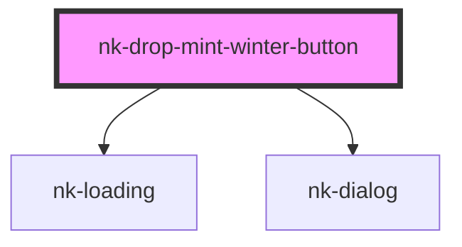

# nk-drop-mint-winter-button

<!-- Auto Generated Below -->

## Properties

| Property                 | Attribute         | Description                       | Type     | Default                        |
| ------------------------ | ----------------- | --------------------------------- | -------- | ------------------------------ |
| `projectId` _(required)_ | `project-id`      | Winter Project Id                 | `string` | `undefined`                    |
| `successMessage`         | `success-message` | Body message on the success modal | `string` | `'Successfully minted an NFT'` |
| `successTitle`           | `success-title`   | Title on the success modal        | `string` | `'Success'`                    |

## Methods

### `openModal() => Promise<void>`

#### Returns

Type: `Promise<void>`

## Shadow Parts

| Part                     | Description |
| ------------------------ | ----------- |
| `"wallet-btn-container"` |             |
| `"winter-btn"`           |             |

## Dependencies

### Depends on

- [nk-loading](../nk-loading)
- [nk-dialog](../nk-dialog)

### Graph

----------------------------------------------

*Built with [StencilJS](https://stenciljs.com/)*
